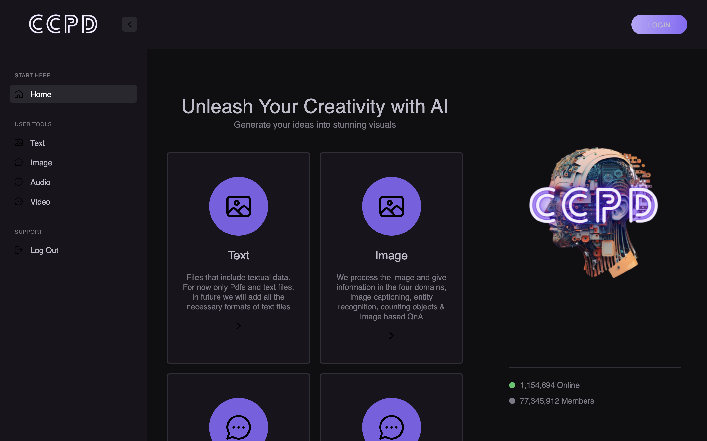

# Cognitive Computing on Personalised Data

## Team members

- Hasnain Sayyed - mohd.sayyed@vit.edu.in
- Bhargav Mahajan - bhargav.mahajan@vit.edu.in
- Ayush Tripathi - ayush.tripathi@vit.edu.in
- Darshan Mahankar - darshan.mahankar@vit.edu.in

## Description

This project aims to address the prevalent issue of context length constraints in language models like ChatGPT. Often, these models face challenges due to their limited ability to process lengthy contexts, which can hinder their performance in generating coherent and contextually accurate responses. To overcome this, the project introduces an innovative approach using Retrieval-Augmented Generation (RAG). RAG assists by dynamically retrieving external data during the generation process, which allows the language model to access a broader range of information without being restricted by its immediate context.

The core of the proposed solution is the development of a web-based platform that integrates a sophisticated vector database designed to store and manage users' data. This platform utilizes advanced semantic search algorithms to analyze and retrieve relevant data from this diverse content repository. After processing the input prompt, the system performs a semantic search to fetch pertinent content, which is then used as references for the language model to enhance the accuracy and relevance of its outputs.

The platform is designed to handle inputs across a diverse formats including images, YouTube links, and MP3 files. For videos, it employs the BART algorithm to summarize the content efficiently, even addressing scenarios where videos are in different languages. This is facilitated by fetching metadata through the YouTube API, which is then effectively summarized using a LLM to provide concise and relevant content overviews. Similarly, the system is equipped to summarize content from images and MP3 files, ensuring a comprehensive and versatile user experience that accommodates various types of media.

Additionally, the platform incorporates the capability to generate images using the Stable Diffusion algorithm, further enriching the user interaction experience by providing visual content generation based on textual prompts. The system also maintains a comprehensive chat history, allowing for continuity in interactions and the ability to reference past conversations.

## Links

- Bachelor Thesis: [Link](./report/Bachelor's%20Thesis.pdf)

- Working: [Link](https://drive.google.com/file/d/1w26LS0k4qnyQ1_euui1IMgHb5_1abz-u/view?usp=sharing)

- Prizes: [Link](./certificates/README.md)

## Technology stack

Tools and technologies that you learnt and used in the project.

1. NextJS
2. Langchain
3. Huggingface API
4. Python Flask
5. Pinecone
6. Firebase

## Project Setup

- For this project, you will have to install packages given in requirements.txt file in the repository, as well as u need openai api key (GPT-4 LLM) for langchain to process the textual documents and data of our application same goes for the output obtained and context length of the chat. The steps to do so are:
  > Clone our repository -> npm install command for NextJs frontend node modules -> pip install requirement.txt for flask backend -> if any package found missing just copy the package name and npm install of pip install it in respective codes
- Run the following commands in separate terminals:

  > For Frontend : npm run dev

  > For Backend : Python app.py

## Usage

- After setup, you can open the link provided for the localhost port.After that, you reach the login screen.
- You can login using your google account which will read your profile name, email, phone and photo and store them in the database as user data.
- Once logged in, you will see options of via text, image in the home page.
- You can choose to go to the chatbot in the AI chatbot tab
- Similarly you can also go to the image generation tab if you just want to generate an image
- for other file types like audio, video we have that functionality integrated in the AI chatbot itself no seperate tabs for that
- In AI chatbot, you can see the chat window in the user input textarea we have provided the options of uploading image, video, audio and text
- There are limitations of which individual type of respective inputs are accepted in our model

  > For Image : JPG, JPEG, PNG

  > For Audio : MP3

  > For Video : Youtube video links only (should be containing subtitles in english)

- Also TEXT-TO-IMAGE, just have to choose the option and enter the text in the same textarea and you will get the output in the chat window itself, and you can continue with the chat.

## Flowchart

## Applications

- Content Curation, News Aggregation, Document Review
- Academic Research, Content Extraction
- Educational Learning, Business Intelligence Reports
- Face Recognition, Security & Surveillance
- Accessibility, Content Generation
- Visual Search, Tourism & Navigation
- Media & Entertainment, Interview Analysis
- Healthcare Services & Professionals

## Future scope

- The Future Scope of this application includes Generative AI functionality.
- Increasing the no of Format accepted by the model
  in each of the image, text, audio and videos.
- Scope of Adding online image, text, audio, video links
  as input.
- Addition of browsing facilities in a seperate panel, running parallel to chat-window of our application so that we can easily access external websites.
- Can train our own models for more faster response to the users

## Screenshots

