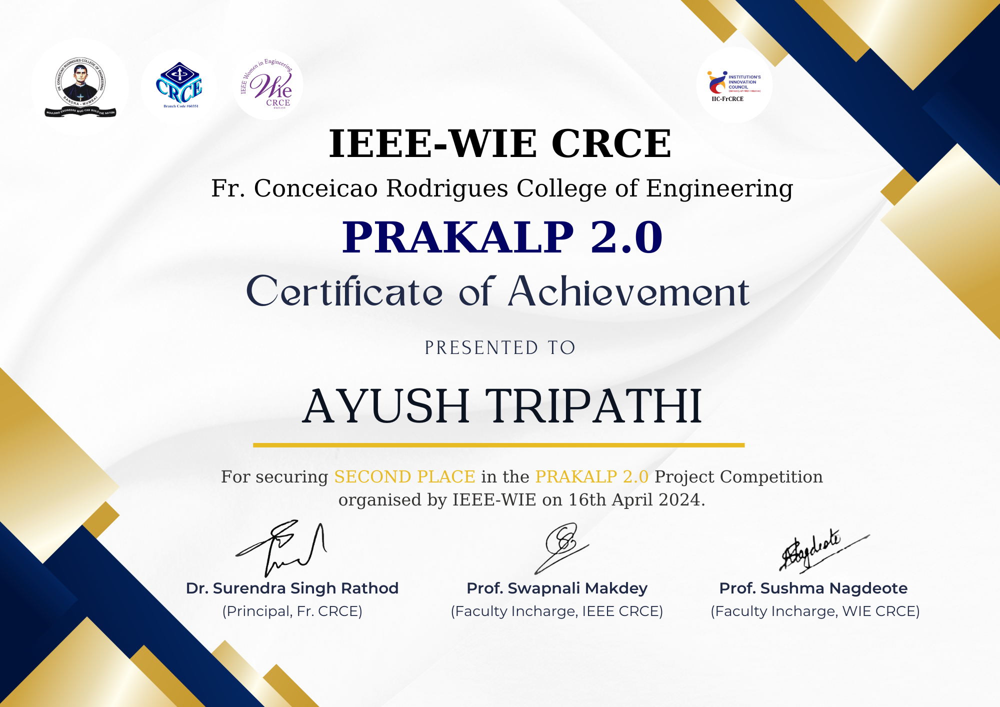
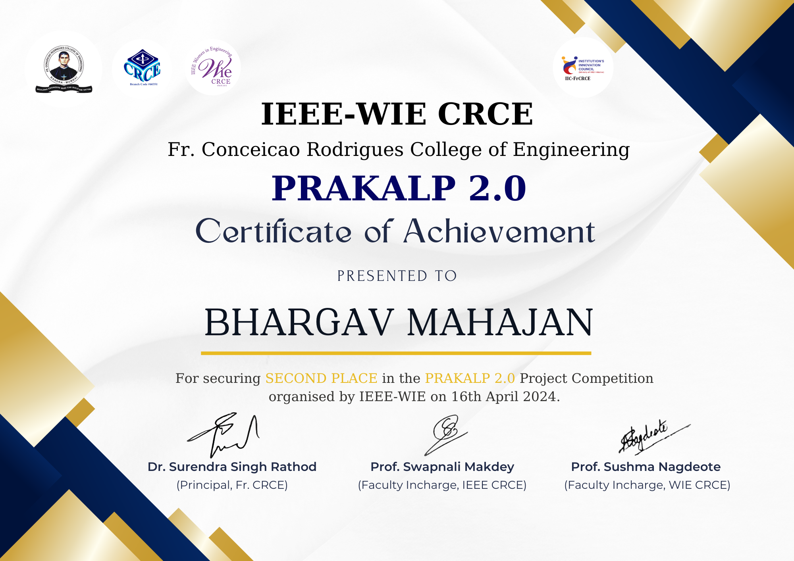
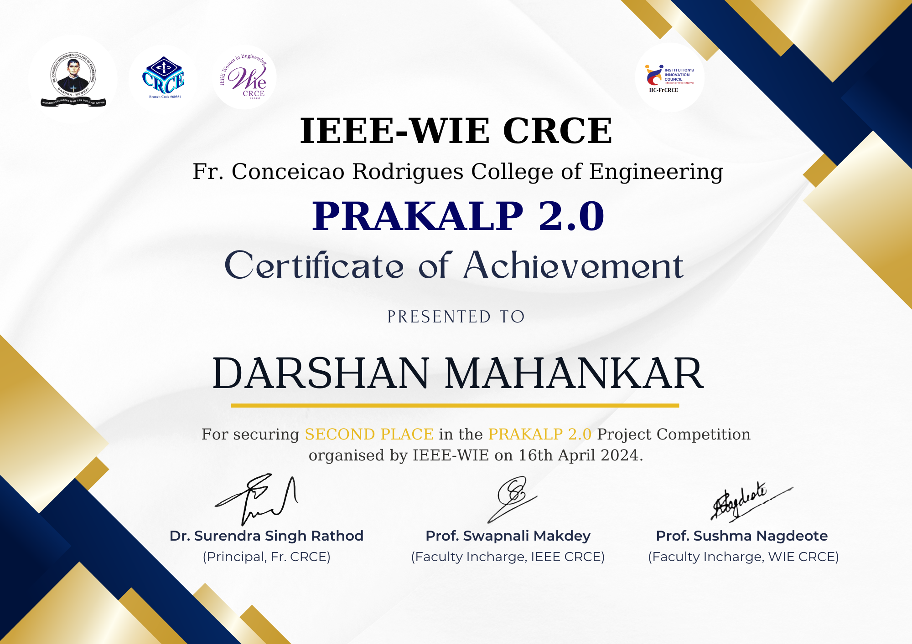

### PRAKALP 2K24 - FR. Conceicao Rodrigues College of Engineering (FRCRCE), Mumbai

[PRAKALP 2K24](https://unstop.com/p/prakalp-2k24-fr-conceicao-rodrigues-college-of-engineering-frcrce-mumbai-938443) is an esteemed national-level project competition organized by FR. Conceicao Rodrigues College of Engineering (FRCRCE), Mumbai. This event provides a platform for engineering students across the country to showcase innovative projects that address real-world challenges. With categories spanning multiple engineering disciplines, participants gain recognition for their creative and technical skills. The competition also fosters collaboration, technical expertise, and creativity, offering attendees an invaluable opportunity for networking and knowledge exchange.

## Runner-up Position

|  |  |
| :-------------------------------------: | :---------------------------: |
|             Hasnain Sayyed              |        Ayush Tripathi         |

|  |  |
| :------------------------------: | :-----------------------------: |
|         Bhargav Mahajan          |        Darshan Mahankar         |
